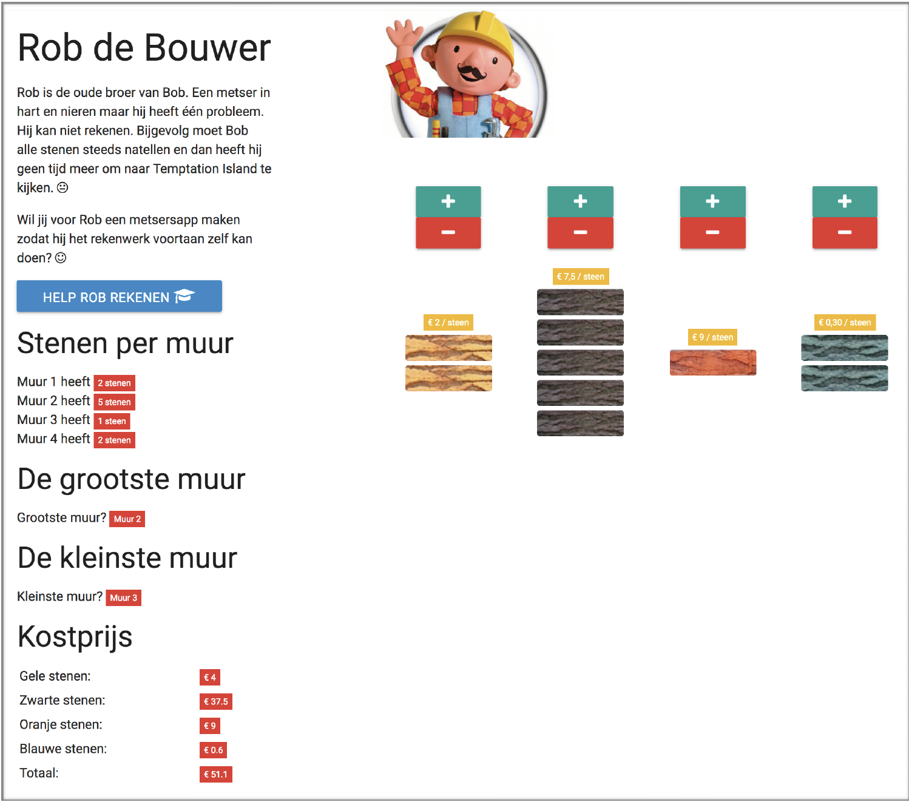
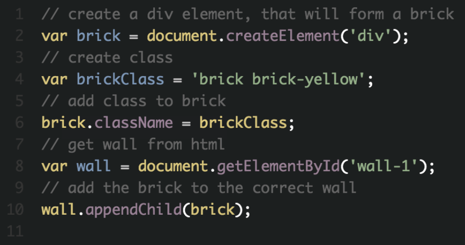

# Rob De Bouwer

4 categories

- Only the exercise ***master***
- Exercise + steps in comments ***guided***
- Exercise + steps in comments + start-code ***extra-guided***
- Solution ***solution***

Excercise - solution
-------

Download de broncode voor deze oefening. [BronCode](./assets/startcode_robdb.zip)

De bedoeling van deze oefening is dat je gebruik kan maken van functies en voorwaardes.
Als er op de knop “Help Rob rekenen” geklikt wordt, dan zal je a.d.h.v jouw script berekenen hoeveel stenen elke muur bevat, welke muur de grootste is, en welke muur de kleinste.
Tot slot bereken je de kostprijs van elke muur en de totaalprijs.
Maak voldoende gebruik van functies, en vergeet geen comments bij te plaatsen.

## Functionaliteiten

Als er op een “+” geklikt wordt

- Er komt één steen bij in de correcte muur (onder de knopjes)

 
Als op een “-“ geklikt wordt

- Er wordt een steen gewist uit de muur
- Als er geen stenen over blijven in de muur, verschijnt een alert met de tekst De muur is volledig gesloopt

 
Met de knop **“HELP ROB REKENEN”** gebeurt het volgende:

- Het aantal stenen wordt getoond voor elke muur:
    - vb. Muur 1 heeft [AANTALSTENEN] waarbij [AANTALSTENEN] uiteraard het aantal stenen betreft van die muur
    - Let op voor enkelvoud en meervoud
        - 1 steen
        - 4 stenen
- De grootste muur wordt bepaald
    - Hiervoor dien je elke muur met elkaar te vergelijken (tip)
- De kleinste muur bepalen
    - Idem als grootste muur (maar dan omgekeerd…)
- Een functie maken dat de kostprijs berekent van elke muur + totaal en op het scherm toont
- De kostprijs van elke steen is
    - Muur 1 = € 2,00 per steen
    - Muur 2 = € 7,50 per steen
    - Muur 3 = € 9,00 per steen
    -  Muur 4 = € 0,30 per steen

 
## TIP 1

Een muurtegel is als volgt opgebouwd:

`

` twee classes:

- brick
- brick-KLEUR (waarbij KLEUR kan variëren tussen yellow, black, orange of blue)

Om een div-tag te maken in javascript en toe te voegen aan een muurtje: 

voorbeeld Rob de bouwer

 
## TIP 2

Om de (berekende) waardes, op het scherm te brengen (dus in de html te steken), kan je gebruik maken van de span-tags, die elk een ID gekregen hebben.
In html staat reeds `0 stenen` in js plaats je de waarde in het element door middel van:

`.textContent = … `  
`var lblWall1 = document.getElementById('wall-1-amountstones'); `  
`lblWall1.textContent = 5;`  
